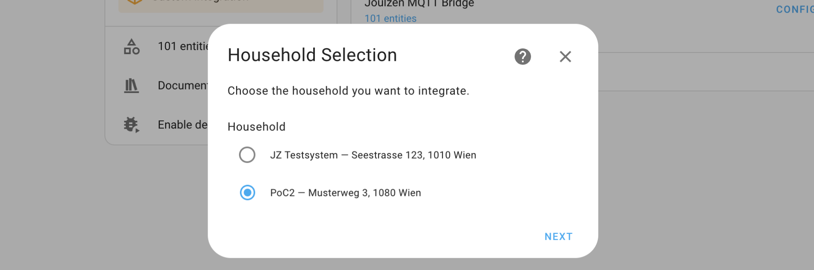
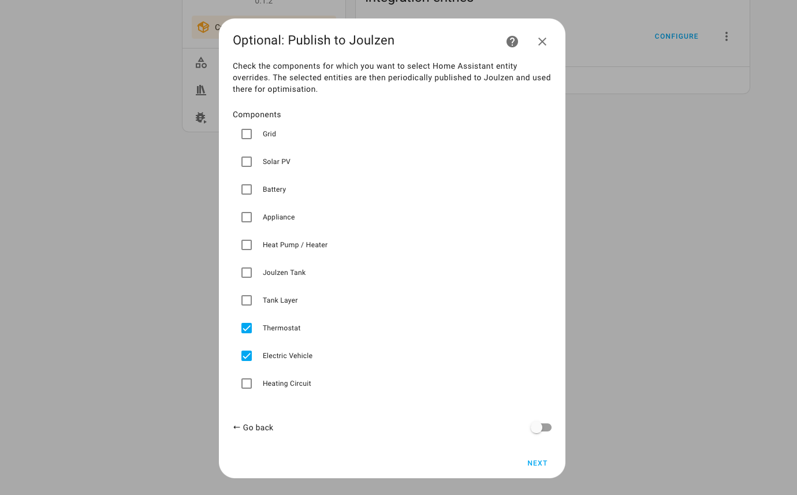
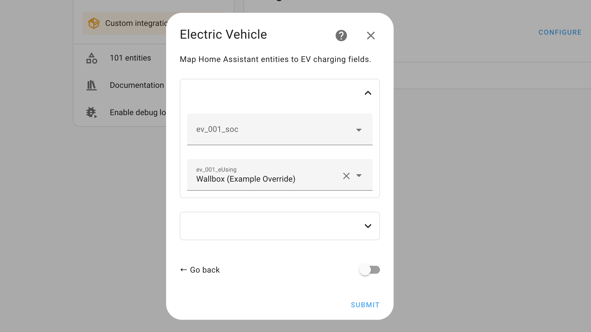
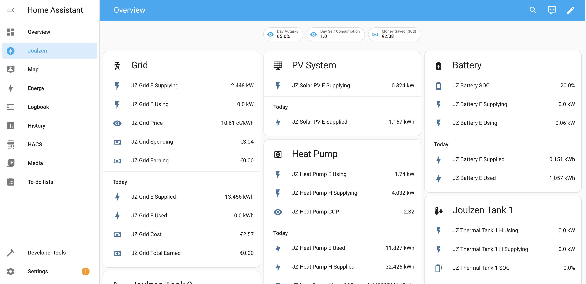

# joulzen-ha

Home Assistant Integration for Joulzen (https://joulzen.at).

This integration pulls live energy data from the Joulzen cloud into Home Assistant as sensors — covering your thermal battery but also grid connection, solar production, battery, heat pump, EV charger, and more, depending on your household setup.

Optionally, you can map local HA sensor entities to specific Joulzen data fields. This is useful when a locally-connected device (e.g. an EV charger or smart meter) provides readings that are otherwise not accessible, or more accurate or timely than what Joulzen receives directly. Mapped values are pushed to Joulzen every 60 seconds.

## Installation

### 1. Install HACS

If you haven't installed [HACS](https://hacs.xyz/docs/use/download/download/) yet, follow the instructions there first.

### 2. Add this repository

In Home Assistant, go to **HACS → Custom Repositories** and add:

```
https://github.com/Joulzen/joulzen-ha
```

Select **Integration** as the category.

### 3. Download the integration

Find **Joulzen** in HACS and click **Download**.

### 4. Add the integration

Go to **Settings → Integrations → Add Integration**, search for **Joulzen**, and follow the setup steps.

### 5. Authenticate

Authenticate via OAuth2 when prompted. Done.

## Configuration

After authentication, the setup wizard walks you through the steps below. You can re-open it at any time via **Settings → Integrations → Joulzen → Configure**.

### Household selection

Choose which household to integrate from the list linked to your Joulzen account.



### Component selection (optional)

Your household consists of components — physical devices such as a grid meter, solar inverter, or battery. This step lets you select which component types you want to provide local sensor overrides for. If you only want to read data from Joulzen without sending any local values back, you can skip this step entirely.



### Entity mapping (optional)

For each selected component type, Joulzen exposes a set of data fields (e.g. current power, daily energy, state of charge). Here you map a local HA sensor entity to each field you want to override. Fields left empty continue to use Joulzen's own data source.

Each component exposes two groups of fields: **live** readings (instantaneous power, updated continuously) and **daily aggregates** (energy totals accumulated since midnight).

**Live fields (power)**

| Field | Unit | Description |
|---|---|---|
| `eSupplying` | kW | Instantaneous electric power the component is **outputting** (e.g. PV production, grid import, battery discharging) |
| `eUsing` | kW | Instantaneous electric power the component is **consuming** (e.g. battery charging, appliance, grid export) |
| `hSupplying` | kW | Instantaneous heat power the component is **outputting** (e.g. a heat pump or Joulzen tank delivering heat) |
| `hUsing` | kW | Instantaneous heat power the component is **consuming** (e.g. a thermal store charging, a thermostat drawing heat) |
| `soc` | % | State of charge (batteries and Joulzen tanks) |

**Daily aggregate fields (energy, reset at midnight)**

| Field | Unit | Description |
|---|---|---|
| `eSupplied` | kWh | Electric energy the component has **output** today |
| `eUsed` | kWh | Electric energy the component has **consumed** today |
| `hSupplied` | kWh | Heat energy the component has **output** today |
| `hUsed` | kWh | Heat energy the component has **consumed** today |



### Dashboard

A **Joulzen** tab is automatically added to your Home Assistant sidebar with a live overview of all components in your household.



## Support
Do you have questions or have feedback?
Please reach out to [office@joulzen.at](mailto:office@joulzen.at)
